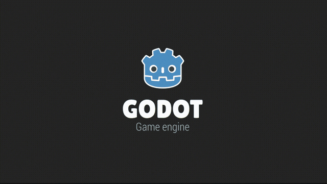

# LeafTween

A tweening package for the Godot Engine, built from scratch to animate values
over time with easing, sequencing, and curved motion.

> **Status:** early development. See [ROADMAP.md](docs/roadmap.md) for the development plan.

## Demo

Custom `ease_out_bounce` and a `Curve`-driven ease (`.set_ease_curve()`), each
compared against its native `Tween`/manual-workaround equivalent. See
`demo/easing/`.

## Why LeafTween

Godot's built-in `Tween` already covers the basics well. LeafTween adds a few
things the native `Tween` doesn't have:

- **Custom easing via a `Curve` resource** — tune an ease visually in the
  inspector instead of picking from the fixed `TransitionType`/`EaseType`
  enums.
- **`stagger()` helper** — animate a list of nodes with an incremental delay
  between each in a single call, no hand-written loop. _(planned — Phase 6)_
- **Curve-based motion (`move_along`)** — Bezier/Catmull-Rom path following
  unified with easing, callbacks, and sequencing, instead of Godot's
  disconnected `Curve2D`/`PathFollow2D`. _(planned — Phase 4)_

See [ROADMAP.md](docs/roadmap.md) for the full plan, including the object-pooling
and generation-counter architecture behind the engine, and
[API Design](docs/api_design.md) for the sketched public API shape.

## Requirements

- Godot `4.7`

## Installation

_TBD_

## Usage

_TBD_

## License

[MIT](LICENSE)
