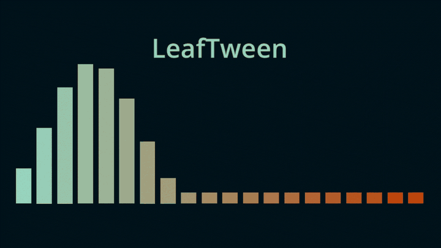

# LeafTween



A tweening package for the Godot Engine, built from scratch to animate values
over time with easing, sequencing, and curved motion.

> **Status:** roadmap complete (Phases 0-6). A personal study project, not
> published to the AssetLib — see [roadmap.md](docs/roadmap.md) for how it
> was built, phase by phase.

## Demo

Each value-add feature has its own comparison demo, next to the
native/manual equivalent it replaces:

- `demo/easing/` — custom `ease_out_bounce` and a `Curve`-driven ease
  (`.set_ease_curve()`), each compared against its native
  `Tween`/manual-workaround equivalent.
- `demo/curves/` — `move_along()` (Bezier + Catmull-Rom) next to a manual
  `Curve2D` + `PathFollow2D` + `tween_method()` setup.
- `demo/sequence/` — `LeafTweenSequence` running 3 tweens in series plus 1 in
  parallel, looping.
- `demo/stagger/` — `stagger()` next to a manual `for` loop with
  `set_delay(i * delay)` on a native `Tween`.

## Why LeafTween

Godot's built-in `Tween` already covers the basics well. LeafTween adds a few
things the native `Tween` doesn't have:

- **Custom easing via a `Curve` resource** — tune an ease visually in the
  inspector instead of picking from the fixed `TransitionType`/`EaseType`
  enums.
- **`stagger()` helper** — animate a list of nodes with an incremental delay
  between each in a single call, no hand-written loop.
- **Curve-based motion (`move_along`)** — Bezier/Catmull-Rom path following
  unified with easing, callbacks, and sequencing, instead of Godot's
  disconnected `Curve2D`/`PathFollow2D`.

See [roadmap.md](docs/roadmap.md) for the full plan, including the object-pooling
and generation-counter architecture behind the engine, and
[API Design](docs/api_design.md) for the sketched public API shape.

## Requirements

- Godot `4.7`

## Installation

1. Copy `addons/leaf_tween/` into your project's `addons/` folder.
2. In Godot, go to **Project → Project Settings → Autoload**.
3. Add `addons/leaf_tween/leaf_tween.gd`, set the node name to `LeafTween`,
   and enable it.

`LeafTween` is now available as a global singleton from any script.

## Usage

```gdscript
# The generic primitive: interpolate any Variant LeafTween's easing/lerp
# supports (float, Vector2/Vector3, Color, ...).
LeafTween.to(0.0, 1.0, 1.0, func(v: float) -> void: progress_bar.value = v)

# Node helpers, chained config, always returns the TweenData for more setters.
LeafTween.move(sprite, Vector2(400.0, 200.0), 0.6) \
	.set_ease(LeafTweenEasing.EaseType.OUT_BOUNCE)
LeafTween.fade(panel, 0.0, 0.3).set_on_complete(panel.hide)

# Curve-based motion.
LeafTween.move_along(marker, my_bezier_path, 2.0)

# Sequencing: series + parallel + looping.
LeafTweenSequence.new() \
	.append(LeafTween.move(node, pos_a, 1.0)) \
	.join(LeafTween.fade(node, 0.0, 1.0)) \
	.append(LeafTween.move(node, pos_b, 1.0)) \
	.set_loop(2)

# Stagger a list of nodes with an incremental delay.
LeafTween.stagger(
	list_items, 0.05,
	func(n: Node) -> TweenData: return LeafTween.move(n, n.position + Vector2(0.0, -20.0), 0.3)
)

# Cancel/pause/resume via a lightweight {index, generation} handle.
var handle: TweenHandle = LeafTween.move(sprite, target, 1.0).get_handle()
LeafTween.pause(handle)
LeafTween.resume(handle)
LeafTween.cancel(handle)
```

## License

[MIT](LICENSE)
